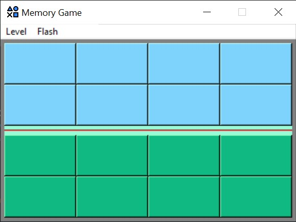

# Memory Game

<b>Number Memory Game made with tkinter in Python.</b>

# Game

The board is divided into two parts, blue and green. In each part there are exactly the same numbers, the game consists of finding the pairs of each number in the shortest possible time.

## Start Window

Here you can select the level of the game. As we will see later, the level will affect the size of the matrix.

## 1. Easy Mode ##
**4x4 matrix - 8 pairs of numbers (0-7)**

## 2. Hard Mode ##
**8x8 matrix - 16 pairs of numbers (0-15)**

## 3. Extreme Mode ##
**12x12 matrix - 36 pairs of numbers (0-35)**

## Menu

Simple menu where we can choose a new level without restarting the game and also activate the flash mode.

| |  | |
| -- | -- | -- |
| | | |
| | | |

### Flash mode

If activated, the two buttons will flash when a pair is found.

## WIN

When the game ends, a congratulation frame will appear and then the time it has lasted.

| |  | |
| -- | -- | -- |
| | | |

